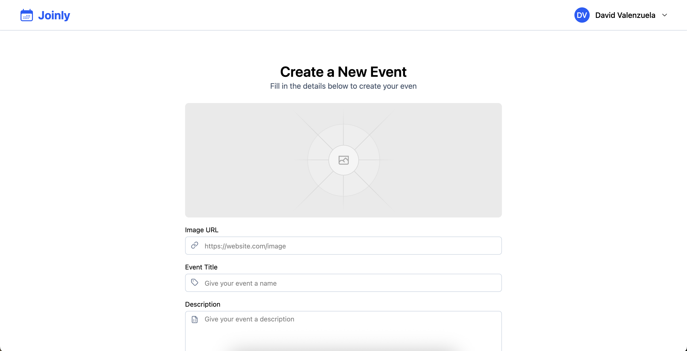
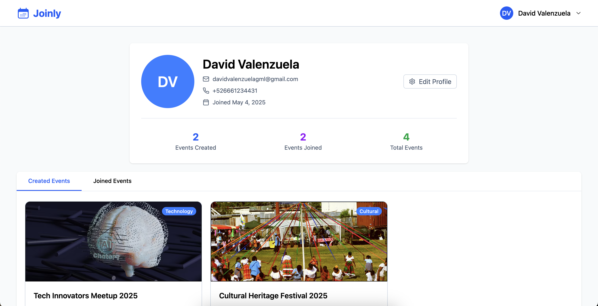
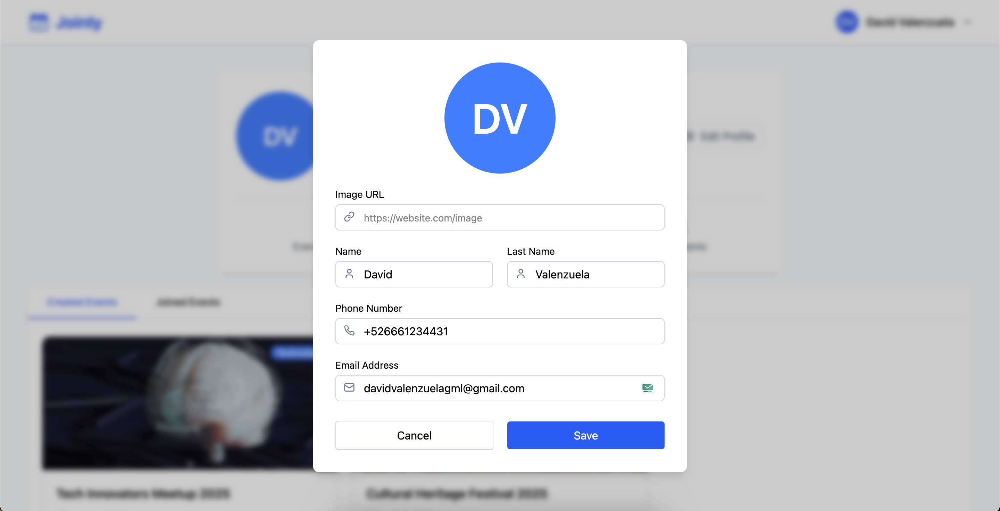

# Joinly Events

## Description

This project is a system for events, in which you can see the available events, when you log in you can join events you want to attend, you can create your own events, edit them, delete them, as well as edit your own profile.

## Technologies Used

- **Frontend**: React.js, TypeScript, TailwindCSS.
- **Backend**: Node.Js, Express.Js.
- **Data Base**: PostgreSQL.
- **Authentication**: JWT + Cookies

## Functionalities

### Home

**Home** is the principal screen where  everyone can see all the events an search for an event.

### Login

In login page you can log in using your email and password.

#### Register

In Register page you can create an account to be able to log in

### Create or Edit Event

In Create event page you can create a new event or edit a previously created event.

#### Profile

In profile page you can show all your information like name, last name, email, etc. and the previously created events.

### Edit Profile

In edit profile page you can edit all your information like name, last name, email, etc.

